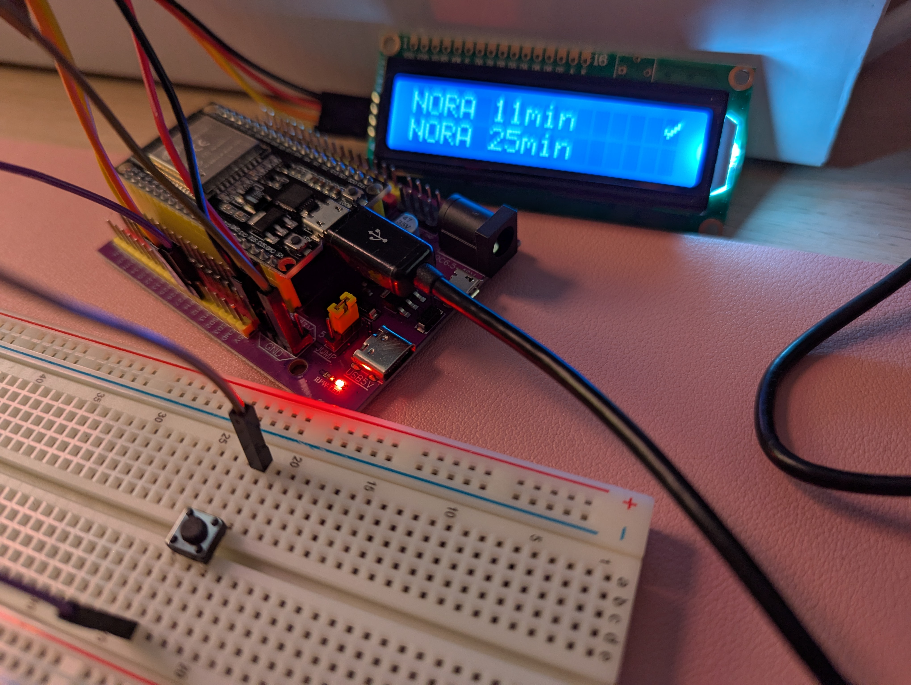

# Prochain Départ



An ESP32-based E-Ink display for real-time public transportation schedules in Île-de-France.

## Overview

Prochain Départ provides real-time departure information for trains and buses in the Île-de-France region. The device uses an ESP32 microcontroller connected to an E-Ink display to show upcoming departures with minimal power consumption.

## Features

- Real-time departure information for RER C and bus lines 323
- E-Ink display for low power consumption and excellent readability
- WiFi connectivity to fetch the latest schedule data
- Physical button for user interaction
- Automatic refresh of departure information

## Hardware Requirements

- ESP32 development board
- 4.2" E-Ink display (GDEY042T81 400x300)
- Momentary push button
- Connecting wires


# TODO
- https://github.com/probonopd/WirelessPrinting?tab=readme-ov-file
 - implement wifi manager
- configuration du StopPoint


# Info
Call the API https://prim.iledefrance-mobilites.fr/fr/apis/idfm-ivtr-requete_unitaire
You need an api key : https://prim.iledefrance-mobilites.fr/fr/mes-jetons-authentification
To find your StopPoint Id : https://prim.iledefrance-mobilites.fr/fr/jeux-de-donnees/arrets-lignes

## Example
```
curl --request GET \
  --url 'https://prim.iledefrance-mobilites.fr/marketplace/stop-monitoring?MonitoringRef=STIF:StopPoint:Q:46366:' \
  --header 'accept: application/json' \
  --header 'apiKey: YOURAPIKEY'
```

# Wiring
| LCD 1602 | ESP32  |
| -------------- | --------------- |
| GND | GND |
| VDD | 5V |
| SDA | G14 |
| SCL | G27 |
| Button | ESP32 |
| -------------- | --------------- |
| 1 | G12 |
| 2 | GND |
* take two diagonal pins

| WeActStudio Eink | ESP32  |
| -------------- | --------------- |
| GND | GND |
| VCC | 3.3V |
| SDA/DIN | G14 |
| SCL/CLK | G13 |
| CS | G15 |
| DC | G27 |
| RST | G26 |
| BUSY | G25 |

```
GxEPD2_BW<GxEPD2_420_GDEY042T81, GxEPD2_420_GDEY042T81::HEIGHT> display(GxEPD2_420_GDEY042T81(/*CS=*/15, /*DC=*/27, /*RST=*/26, /*BUSY=*/25)); // 400x300, SSD1683

// *** special handling for Waveshare ESP32 Driver board *** //
    // ********************************************************* //
    hspi.begin(13, 12, 14, 15); // remap hspi for EPD (swap pins)
    display.epd2.selectSPI(hspi, SPISettings(4000000, MSBFIRST, SPI_MODE0));
    // *** end of special handling for Waveshare ESP32 Driver board *** //
    // **************************************************************** //
```
